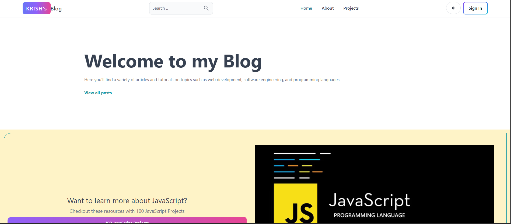

# Blog Application

# Introduction
This project is a full-featured blog application built using the MERN stack (MongoDB, Express.js, React, and Node.js). The application offers a secure user authentication system with JWT (JSON Web Token), ensuring that only authenticated users can create, comment on, or interact with blogs. Redux Toolkit is utilized for efficient state management,. Users can easily search for blogs, comment on posts, and explore the top-rated blogs based on user engagement. 

# Tech Stack
- **Frontend**: React.js, Redux Toolkit, Tailwind CSS
- **Backend**: Node.js, Express.js
- **Database**: MongoDB
- **Authentication**: JWT (JSON Web Token)
- **State Management**: Redux Toolkit
- **Styling**: Tailwind CSS

# Features
- User authentication with JWT
- Create, read, update, and delete (CRUD) operations for blogs
- Commenting and user interaction
- Blog search and top-rated blog display